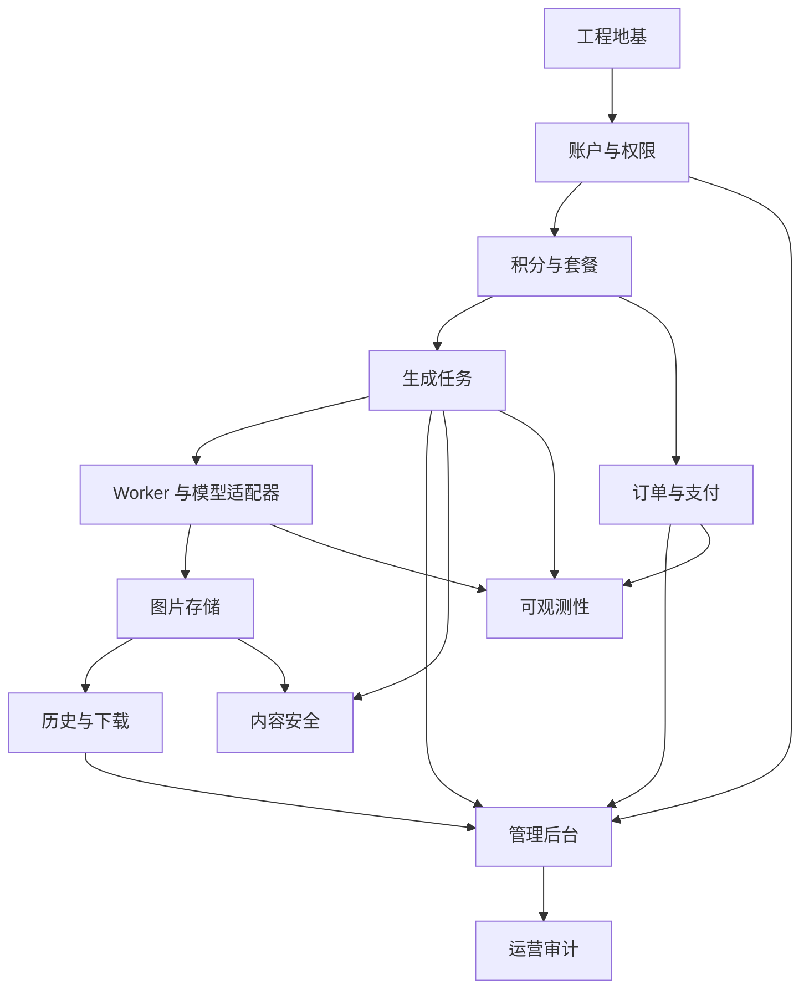

# Imagora 开发周期与闯关计划

## 1. 文档信息

| 项目 | 内容 |
| --- | --- |
| 项目名称 | Imagora |
| 文档名称 | Imagora 开发周期与闯关计划 |
| 版本 | v1.0 |
| 日期 | 2026-06-09 |
| 输入文档 | AI图片生成网站用户需求文档.md、Imagora技术实现文档.md |
| 适用范围 | MVP 到首版商业化上线的开发排期、功能拆分、验收闯关、风险补齐 |

## 2. 文档目标

本文把 Imagora 的开发工作拆成“周期 + 闯关”模式：每个周期都有明确功能范围，每个关卡都有实现步骤、边界处理、性能优化、安全策略、可维护性要求和验收标准。

这不是那种写给老板看的“第 1 周搭框架，第 2 周全功能完成”的玄学排期。AI 图片生成网站真正难的不是页面画出来，而是任务异步、积分一致性、图片权限、支付幂等、内容安全和成本控制。这里不提前把坑写清楚，后面上线就会一边扣用户积分一边丢任务，粤西老表见了都摇头。

## 3. 成熟产品与公开资料对标

### 3.1 对标来源

以下对标以官方公开文档或帮助中心为主，访问日期为 2026-06-09。

| 来源 | 可借鉴能力 | Imagora 需要吸收的点 |
| --- | --- | --- |
| [OpenAI Image generation docs](https://platform.openai.com/docs/guides/image-generation?lang=curl) | 文生图、图片编辑、参考图、输出尺寸、质量、格式、压缩、透明背景、审核参数 | 生成参数要结构化；模型供应商要适配；输出格式和质量要进入成本计算 |
| [OpenAI Images API Reference](https://platform.openai.com/docs/api-reference/images/overview) | 编辑接口、参考图数组、mask、moderation、输出格式 | P1/P2 阶段补图生图、局部重绘、审核强度配置 |
| [Midjourney Aspect Ratio](https://docs.midjourney.com/hc/en-us/articles/31894244298125-Aspect-Ratio) | 比例参数、默认 1:1、常用比例、极端比例限制 | MVP 支持常用比例，限制极端比例，避免模型不可控 |
| [Midjourney Modifying Your Creations](https://docs.midjourney.com/hc/en-us/articles/33329329805581-Modifying-Your-Creations) | 变体、放大、Remix、Pan、Zoom Out、局部修改 | 首版至少做“再次生成”和“变体”；后续做放大、局部修改、扩图 |
| [Midjourney Parameter List](https://docs.midjourney.com/docs/parameter-list) | 参数化控制，如 aspect、quality、no、style、repeat | 表单参数要可解释，不要让用户手搓复杂参数 |
| [Midjourney Permutations](https://docs.midjourney.com/hc/en-us/articles/32761322355597-Permutations) | 批量探索提示词组合 | P2 做批量生成和提示词变量，不放进 MVP |
| [Adobe Firefly Generative Credits FAQ](https://helpx.adobe.com/firefly/using/generative-credits-faq.html) | 生成积分、月度额度、不同功能不同消耗 | Imagora 积分账本要有周期、过期、权益、功能消耗配置 |
| [Adobe Firefly Generative Credits Overview](https://helpx.adobe.com/firefly/using/generative-credits.html) | 创意工具内统一生成额度 | 积分体系要能支持未来图生图、扩图、视频等不同成本 |
| [Canva AI image generation help](https://www.canva.com/en_gb/help/generate-images-ai/) | 多模型入口、设计工作流内生成图片 | Imagora 后续应支持模板化场景，不只做孤立生成器 |
| [Canva Magic Media article](https://www.canva.com/newsroom/news/text-to-image-ai-image-generator/) | 风格、变体、直接进入设计资产 | 图片结果要能进入收藏、历史、再次生成和下载工作流 |
| [Stability AI Developer Platform](https://platform.stability.ai/) | Upscale、Inpaint、Outpaint、Remove Background、Replace Background | P2 能力池：放大、局部重绘、扩图、去背景、换背景 |
| [OWASP API Security Top 10](https://owasp.org/API-Security/editions/2023/en/0x00-header/) | BOLA、认证、资源消耗、函数级权限、错误配置 | 每个私有资源接口必须做所属权校验和限流 |
| [OWASP File Upload Cheat Sheet](https://cheatsheetseries.owasp.org/cheatsheets/File_Upload_Cheat_Sheet.html) | 扩展名、Content-Type、文件签名、文件名、权限、上传下载限制 | 参考图上传不能只看后缀，必须校验 MIME 和文件签名 |
| [OWASP Password Storage Cheat Sheet](https://cheatsheetseries.owasp.org/cheatsheets/Password_Storage_Cheat_Sheet.html) | Argon2id、bcrypt、salt、work factor | 密码存储必须哈希，禁止明文和可逆加密 |
| [web.dev Core Web Vitals](https://web.dev/articles/vitals?hl=en) | LCP、INP、CLS 体验指标 | 图片重页面必须关注首屏、交互延迟和布局稳定 |

### 3.2 对标结论

成熟产品不是只强在“能生成图”，而是强在生成后的创作链路：

1. Midjourney 的强点是参数、变体、放大、局部修改和批量探索。
2. OpenAI 图片接口的强点是生成、编辑、参考图、输出质量和审核参数清晰。
3. Adobe Firefly 的强点是积分和创意软件生态中的权益管理。
4. Canva 的强点是把生成图片直接放进设计工作流，而不是生成完让用户自己孤零零下载。
5. Stability 的强点是图像后处理能力池，包括放大、局部重绘、扩图、去背景、换背景。
6. OWASP 和 web.dev 提供安全与性能底线，不按这些做，产品没成熟就先露馅。

### 3.3 Imagora 当前不足与补齐方向

| 当前不足 | 风险 | 补齐动作 | 放入阶段 |
| --- | --- | --- | --- |
| 需求文档有生成历史，但没有明确任务幂等 | 用户重复点击导致重复扣积分和重复任务 | 创建任务使用 `clientRequestId`，积分流水使用幂等键 | 第 4 关 |
| 需求文档有图片下载，但没有明确下载鉴权 | 私有图片被盗链或越权下载 | 下载接口返回短期签名 URL，服务端校验 `user_id` | 第 6 关 |
| 技术文档有 Worker，但没有细化补偿扫描 | 队列投递失败或 Worker 崩溃导致任务卡死 | 增加任务超时扫描、失败退款补偿、重投队列 | 第 5 关 |
| 支付模块有订单，但没有完整事件幂等 | 支付回调重复发积分 | `payment_events` 唯一索引和事务发放 | 第 7 关 |
| 内容安全有拦截，但没有分层策略 | 过度拦截影响体验，放松又有合规风险 | 本地规则 + 第三方审核 + 人工复核队列 | 第 8 关 |
| 图片多但未明确前端性能指标 | 首页和历史页图片多时加载慢、布局跳动 | 缩略图、懒加载、固定宽高、Core Web Vitals 监测 | 第 6 关 |
| 后台管理有列表，但没有审计闭环 | 管理员误操作不可追踪 | 所有后台写操作记录 `admin_audit_logs` | 第 9 关 |
| 没有明确模型成本映射 | 运营无法控制毛利 | 模型、质量、尺寸、数量统一进入成本配置表 | 第 3 关 |
| 缺少灰度和功能开关 | 新模型、新支付、新审核上线风险大 | 增加 feature flags 和供应商配置 | 第 10 关 |

## 4. 人力与周期假设

### 4.1 默认人力

| 角色 | 人数 | 主要职责 |
| --- | --- | --- |
| 产品/项目负责人 | 1 | 需求冻结、优先级、验收、运营策略 |
| UI/UX 设计 | 1 | 前台和后台页面、交互、响应式 |
| 前端工程师 | 2 | Web、后台、状态轮询、图片体验 |
| 后端工程师 | 2 | API、数据库、积分、支付、队列、权限 |
| 测试/QA | 1 | 测试用例、回归、E2E、边界验证 |
| 运维/后端兼任 | 1 | 部署、日志、监控、告警 |

如果只有 1 个全栈开发，也不是不能做，但周期要按至少 2.5 到 3 倍估算。一个人想 8 周做完全套商业化 AI 图片站，那属于“啤酒还没开就说自己能把珠江游过去”。

### 4.2 总周期

MVP 到可灰度上线建议 12 周。商业化首版建议 14 到 16 周。

| 周期 | 关卡 | 核心目标 | 交付物 |
| --- | --- | --- | --- |
| 第 0 周 | 第 0 关：范围冻结与技术基线 | 锁定 MVP、供应商沙箱、成本假设 | 范围清单、验收矩阵、环境清单 |
| 第 1 周 | 第 1 关：工程地基 | Monorepo、基础服务、数据库、质量门禁 | 可启动工程、CI、基础迁移 |
| 第 2 周 | 第 2 关：账户与权限 | 注册登录、用户资料、管理员角色 | 认证接口、用户表、权限中间件 |
| 第 3 周 | 第 3 关：积分与套餐基础 | 积分账户、流水、消耗预估、套餐配置 | 积分账本、套餐表、成本配置 |
| 第 4-5 周 | 第 4 关：图片生成任务闭环 | 创建任务、扣积分、队列、Worker、模型适配器 | 文生图 MVP 闭环 |
| 第 6 周 | 第 5 关：任务补偿与状态体验 | 失败退款、超时扫描、状态轮询、重试 | 可恢复任务系统 |
| 第 7 周 | 第 6 关：图片资产管理 | 历史、收藏、下载、删除、详情、缩略图 | 图片资产工作流 |
| 第 8 周 | 第 7 关：订单与支付 | 下单、支付回调、权益发放、订单列表 | 商业化闭环 |
| 第 9 周 | 第 8 关：内容安全与上传 | 提示词审核、参考图上传、生成图审核 | 安全审核链路 |
| 第 10 周 | 第 9 关：管理后台 | 用户、任务、图片、订单、套餐、审计 | 运营后台 |
| 第 11 周 | 第 10 关：性能、可观测性与部署 | 日志、指标、告警、缓存、CDN、部署 | 可灰度环境 |
| 第 12 周 | 第 11 关：总回归与灰度上线 | E2E、压测、故障演练、上线清单 | 灰度上线版本 |

P1/P2 增强能力建议放到第 13 周之后，不要挤进 MVP：

| 增强周期 | 能力 | 说明 |
| --- | --- | --- |
| 第 13-14 周 | 图生图、参考图强度 | 对标 OpenAI 参考图、Leonardo/Canva 图像引导 |
| 第 15-16 周 | 变体、放大、局部重绘 | 对标 Midjourney Vary/Upscale/Vary Region、Stability Inpaint/Upscale |
| 第 17 周以后 | 批量生成、提示词变量、模板场景 | 对标 Midjourney Permutations、Canva 设计工作流 |

## 5. 闯关规则

### 5.1 每关必须满足的通用条件

1. 功能完成：本关 P0 功能可用。
2. 数据正确：关键数据能落库、可查询、可追踪。
3. 边界覆盖：至少覆盖失败、重复提交、越权、空值、异常返回。
4. 安全过线：认证、授权、输入校验、敏感信息保护符合本关要求。
5. 性能不过分拉胯：核心接口和页面达到本关设定目标。
6. 可维护：模块边界清楚，核心逻辑有单元测试，外部供应商通过适配器。
7. 可验收：QA 有明确测试用例，产品能按验收清单确认。

### 5.2 闯关失败规则

出现以下任一情况，本关不得通过：

1. 用户能访问他人的私有图片、任务、订单或积分流水。
2. 任务失败后积分重复退还或不退还。
3. 支付重复回调导致重复发放权益。
4. 内容安全拦截可以被明显绕过。
5. Worker 崩溃后任务永久卡死且无补偿。
6. 后台普通用户可访问。
7. 生产密钥暴露到前端。
8. 关键功能没有测试或无法复现验证。

## 6. 第 0 关：范围冻结与技术基线

### 6.1 周期

第 0 周，建议 2 到 3 个工作日。

### 6.2 目标

把 MVP 范围、技术栈、供应商、成本规则和验收边界先锁住。这个关卡不写代码，主要避免后面研发做到一半，突然冒出“顺手加个视频生成呗”，这种话听多了容易血压上来。

### 6.3 实现步骤

1. 确认 MVP P0 范围：账户、生成、历史、积分、下载、支付基础、后台基础、内容安全基础。
2. 确认暂不做范围：完整编辑器、团队协作、API 开放平台、模板市场、批量生成。
3. 选择默认技术栈：Next.js、TypeScript、API 服务、PostgreSQL、Redis、BullMQ、Prisma、对象存储。
4. 确认 AI 模型供应商沙箱账号和调用限制。
5. 确认支付渠道优先级：国内微信/支付宝或海外 Stripe。
6. 确认对象存储和 CDN 供应商。
7. 确认内容审核方案：先本地规则 + 可插拔第三方审核。
8. 定义积分消耗基础规则：尺寸、数量、质量、模型倍率。
9. 输出验收矩阵：每个功能对应需求编号、接口、页面、测试用例。

### 6.4 边界处理

1. 供应商未确定：先实现 mock provider 和适配器接口。
2. 支付渠道未确定：先做订单状态机和支付适配器，不把某一家支付 SDK 写死。
3. 内容审核未确定：先实现本地敏感词和审核事件表。
4. 商用授权未确定：前台先展示“使用条款待确认”，后台预留授权配置。

### 6.5 性能策略

1. 定义生成任务提交接口目标：2 秒内返回任务 ID。
2. 定义图片列表目标：首屏只加载缩略图，分页大小默认 20。
3. 定义 Core Web Vitals 基线：LCP 小于 2.5 秒、INP 小于 200ms、CLS 小于 0.1。

### 6.6 安全策略

1. 确认密码存储使用 Argon2id 或 bcrypt。
2. 确认 Cookie 策略：`HttpOnly`、`Secure`、`SameSite`。
3. 确认所有私有资源都按 `user_id` 做所属权校验。
4. 确认上传文件执行扩展名、MIME、文件签名、大小、尺寸多重校验。

### 6.7 可维护性策略

1. 所有外部服务必须适配器化。
2. 所有枚举集中定义在共享包。
3. 错误码统一，不允许各模块随便返回字符串。
4. 所有配置通过环境变量和配置表，不硬编码。

### 6.8 成熟功能对比与补齐

| 成熟产品做法 | Imagora 补齐 |
| --- | --- |
| OpenAI 将生成、编辑、输出质量、审核参数结构化 | Imagora 生成参数从第一版就用结构化字段，而不是把一切塞进 prompt |
| Adobe Firefly 以积分承载不同生成能力 | Imagora 建立积分账本和功能成本配置，支持未来扩展 |
| Midjourney 参数能力丰富但复杂 | Imagora MVP 用表单降低门槛，高级参数后续折叠 |

### 6.9 过关标准

1. 需求范围表已冻结。
2. 供应商未定项都有 mock 和适配器方案。
3. 成本、积分、任务、支付、安全的关键规则已写入开发任务。
4. 本文档后续关卡的 P0 范围得到确认。

## 7. 第 1 关：工程地基

### 7.1 周期

第 1 周。

### 7.2 目标

建立可持续开发的工程基础。别小看这一关，地基没打好，后面就是“今天这个包不能编译，明天那个服务起不来”，研发体验跟踩泥坑一样。

### 7.3 功能与模块

| 模块 | 功能 |
| --- | --- |
| Monorepo | `apps/web`、`apps/api`、`apps/worker`、`packages/shared`、`packages/database` |
| 数据库 | PostgreSQL、Prisma schema、迁移 |
| 队列 | Redis、BullMQ 基础连接 |
| 质量门禁 | lint、type check、test、build |
| 配置 | `.env.example`、配置加载、密钥隔离 |
| 日志 | requestId、结构化日志基础 |

### 7.4 实现步骤

1. 初始化仓库结构。
2. 建立统一 TypeScript 配置，开启 `strict`。
3. 建立包管理和 workspace。
4. 配置 ESLint、Prettier、测试框架。
5. 建立 `packages/shared`，定义通用枚举、错误码、分页类型。
6. 建立 `packages/database`，创建 Prisma schema 初版。
7. 配置 PostgreSQL 和 Redis 本地开发环境。
8. API 服务提供 `/health`。
9. Worker 提供启动日志和 Redis 连接检查。
10. Web 提供基础布局和路由。
11. CI 或本地脚本串联 `lint`、`types`、`test`、`build`。

### 7.5 边界处理

1. 数据库连接失败：API `/health` 返回 unhealthy，并记录错误。
2. Redis 连接失败：Worker 不消费任务，避免假运行。
3. 环境变量缺失：启动阶段直接失败，不进入半残状态。
4. 迁移失败：不得启动生产服务。
5. 端口冲突：本地文档说明默认端口和替代端口。

### 7.6 性能优化

1. Web 开启构建产物分析，避免首页引入后台大包。
2. API 日志避免同步阻塞。
3. 数据库连接池设置最小和最大连接数。
4. Redis 连接复用，不在每个请求里创建连接。

### 7.7 安全策略

1. `.env` 加入忽略列表，提供 `.env.example`。
2. 生产密钥只从环境变量读取。
3. 健康检查不返回敏感配置。
4. 默认 CORS 只允许配置过的前端域名。
5. API 错误默认不暴露堆栈。

### 7.8 可维护性

1. 每个 feature module 分 controller、service、repository、types。
2. 公共类型只放跨模块真实共享内容，不做万能垃圾桶。
3. 错误码集中维护。
4. 配置按模块读取，避免到处访问 `process.env`。

### 7.9 成熟功能对比与补齐

| 对标 | 补齐动作 |
| --- | --- |
| OpenAI、Stability 等 API 都有清晰服务边界和接口对象 | Imagora 从第一关建立 API、Worker、适配器边界 |
| OWASP API Top 10 提醒错误配置和资产管理风险 | 配置集中、健康检查最小暴露、接口清单可追踪 |

### 7.10 过关标准

1. Web、API、Worker 可本地启动。
2. PostgreSQL、Redis 可连接。
3. 迁移可执行。
4. `/health` 正常。
5. 质量门禁脚本存在并通过。
6. `.env.example` 完整。

## 8. 第 2 关：账户与权限

### 8.1 周期

第 2 周。

### 8.2 目标

完成注册、登录、退出、当前用户、管理员角色和基础权限。后续所有私有数据都要靠这一关兜底。

### 8.3 功能与模块

| 模块 | 功能 |
| --- | --- |
| 用户账户 | 邮箱注册、登录、退出、当前用户 |
| 密码 | 哈希存储、密码重置预留 |
| 会话 | Cookie 会话或 JWT 会话 |
| 权限 | 普通用户、管理员 |
| 前端页面 | 登录页、注册页、账户入口 |
| 后台保护 | 管理员路由守卫 |

### 8.4 实现步骤

1. 创建 `users` 表。
2. 创建注册接口，校验邮箱格式、密码强度、重复邮箱。
3. 密码使用 Argon2id 或 bcrypt 存储。
4. 创建登录接口，校验密码后写入安全 Cookie。
5. 创建退出接口，清除 Cookie 或会话。
6. 创建 `/api/auth/me` 返回当前用户。
7. 创建认证中间件，解析当前用户。
8. 创建管理员权限中间件。
9. 前端实现登录、注册、退出、当前用户状态。
10. 后台路由未登录跳登录，非管理员返回无权限。
11. 登录、注册、密码重置接口加限流。

### 8.5 边界处理

1. 邮箱已存在：返回统一错误，不泄露过多账户状态。
2. 密码错误：错误文案不区分邮箱不存在和密码错误。
3. 用户被封禁：禁止登录，已登录会话失效。
4. Cookie 过期：前端自动进入未登录态。
5. 管理员访问普通页面：正常访问。
6. 普通用户访问后台：返回 403。
7. CSRF 风险：写操作需要 CSRF 防护或 SameSite 策略配合。

### 8.6 性能优化

1. 当前用户信息可以短时间缓存，但权限判断必须以服务端为准。
2. 登录密码哈希成本要平衡安全和响应时间。
3. 限流计数放 Redis，避免打爆数据库。

### 8.7 安全策略

1. 密码不明文存储，不记录日志。
2. Cookie 使用 `HttpOnly`、`Secure`、`SameSite=Lax` 或更严格配置。
3. 登录失败限流。
4. 密码重置 token 只存哈希，并设置有效期。
5. 所有后台接口服务端强制校验角色。

### 8.8 可维护性

1. `AuthService` 只处理认证逻辑，用户资料由 `UsersService` 处理。
2. 密码策略集中配置。
3. 权限中间件统一，不在 controller 里手写重复判断。
4. 用户状态枚举集中定义。

### 8.9 成熟功能对比与补齐

| 成熟做法 | Imagora 补齐 |
| --- | --- |
| OWASP 密码存储建议使用安全哈希算法和 work factor | 明确 Argon2id/bcrypt，禁止明文和可逆加密 |
| OWASP API 安全强调认证和函数级授权 | 普通用户和管理员接口从路由层开始隔离 |

### 8.10 过关标准

1. 用户可注册、登录、退出。
2. 密码数据库中不可见明文。
3. `/api/auth/me` 能正确返回当前用户。
4. 普通用户不能访问后台接口。
5. 登录失败限流生效。
6. 至少覆盖注册、登录、退出、管理员拒绝访问测试。

## 9. 第 3 关：积分与套餐基础

### 9.1 周期

第 3 周。

### 9.2 目标

建立积分账本、套餐和生成成本配置。AI 产品没有成本控制就是开门送钱，模型供应商开心，自己钱包哭出声。

### 9.3 功能与模块

| 模块 | 功能 |
| --- | --- |
| 积分账户 | 余额、累计获得、累计消耗 |
| 积分流水 | 获取、消耗、退款、过期、调整 |
| 成本配置 | 模型、尺寸、质量、数量倍率 |
| 套餐 | 套餐列表、价格、积分数、上下架 |
| 前端 | 余额展示、预计消耗展示 |
| 后台预留 | 套餐管理、成本配置管理 |

### 9.4 实现步骤

1. 创建 `user_credit_accounts` 表。
2. 创建 `credit_ledger_entries` 表。
3. 用户注册后初始化积分账户。
4. 创建积分余额接口。
5. 创建积分流水查询接口。
6. 创建生成消耗计算服务 `CreditPricingService`。
7. 创建套餐表 `plans`。
8. 创建可购买套餐列表接口。
9. 前端在生成页展示当前余额和预计消耗。
10. 后台预留套餐配置接口。
11. 建立幂等键规则，例如 `task:{taskId}:spend`、`task:{taskId}:refund`、`order:{orderId}:grant`。

### 9.5 边界处理

1. 余额不足：生成任务创建前返回 `INSUFFICIENT_CREDITS`。
2. 成本配置缺失：不能提交任务，返回配置错误。
3. 套餐下架：不能新建订单，但历史订单可查看。
4. 积分为负：数据库约束和事务校验双重防止。
5. 重复扣费：幂等键唯一索引阻止。
6. 重复退款：幂等键唯一索引阻止。
7. 管理员调整积分：必须写备注和审计日志。

### 9.6 性能优化

1. 用户余额读频繁，可短缓存，但扣减必须读数据库并锁行。
2. 套餐列表可缓存。
3. 成本配置可缓存，后台修改后失效。
4. 积分流水分页查询，默认 20 条。

### 9.7 安全策略

1. 积分变更只能由服务端业务动作触发。
2. 前端传入的消耗积分不可信，只能由服务端计算。
3. 普通用户只能查看自己的余额和流水。
4. 后台人工调积分必须管理员权限和审计日志。

### 9.8 可维护性

1. 积分扣减和退款封装为独立服务，不散落在任务和支付模块。
2. 流水表只追加，不物理删除。
3. 成本计算规则配置化。
4. 积分相关错误码统一。

### 9.9 成熟功能对比与补齐

| 成熟做法 | Imagora 补齐 |
| --- | --- |
| Adobe Firefly 使用生成积分承载功能成本和订阅权益 | Imagora 使用账本和成本配置支持未来不同功能差异化消耗 |
| 成熟 SaaS 支付产品会区分订单、权益和流水 | Imagora 不直接改余额了事，必须写流水、来源和幂等键 |

### 9.10 过关标准

1. 用户注册后有积分账户。
2. 余额和流水接口正确。
3. 生成预估消耗可用。
4. 余额不足不能提交生成。
5. 重复扣费和重复退款被唯一索引阻止。
6. 积分服务单元测试覆盖成本计算、扣减、退款。

## 10. 第 4 关：图片生成任务闭环

### 10.1 周期

第 4 到第 5 周。

### 10.2 目标

打通最核心的文生图闭环：表单提交、参数校验、安全初筛、创建任务、扣积分、投递队列、Worker 调模型、存储图片、返回结果。

### 10.3 功能与模块

| 模块 | 功能 |
| --- | --- |
| 生成表单 | prompt、negative prompt、style、aspect ratio、quantity、quality |
| 任务 API | 创建任务、查询任务、任务列表 |
| 队列 | generation queue |
| Worker | 消费任务、调用模型、上传图片 |
| 模型适配器 | mock provider、真实 provider |
| 存储适配器 | 上传原图、生成访问 key |
| 数据 | `generation_tasks`、`generated_images` |

### 10.4 实现步骤

1. 创建 `generation_tasks` 表。
2. 创建 `generated_images` 表。
3. 定义任务状态机：`PENDING`、`RUNNING`、`SUCCEEDED`、`FAILED`、`BLOCKED`、`CANCELED`。
4. 实现生成参数 schema 校验。
5. 实现比例到尺寸映射，例如 1:1、3:4、4:3、9:16、16:9。
6. 实现风格枚举和 prompt 组装规则。
7. 创建 `POST /api/generation/tasks`。
8. 服务端生成 `taskId`，使用数据库事务检查余额、创建任务、扣积分、写流水。
9. 事务成功后投递 BullMQ 队列。
10. Worker 消费任务，从数据库读取完整任务参数。
11. Worker 标记任务为 `RUNNING`。
12. 调用模型适配器生成图片。
13. 下载或接收模型图片数据。
14. 上传原图到对象存储。
15. 写入 `generated_images`。
16. 标记任务 `SUCCEEDED`。
17. 前端轮询任务状态并展示图片。
18. 实现 mock provider，确保没有真实模型 key 时也能完成开发和测试。

### 10.5 边界处理

1. prompt 为空：返回 `VALIDATION_ERROR`。
2. prompt 超长：截断不可取，必须返回错误，让用户修改。
3. 不支持的比例：返回错误，不悄悄替换。
4. 数量超过上限：返回错误。
5. 余额不足：不创建任务，不扣积分。
6. 用户重复点击：使用 `clientRequestId` 幂等，同一请求不重复创建任务。
7. 队列投递失败：任务进入 `PENDING`，由补偿扫描重新投递，或标记失败并退款。
8. Worker 拿到已完成任务：直接跳过。
9. 模型返回图片数量不足：按实际结果入库，任务可标记部分失败或失败，MVP 建议失败并退款。
10. 模型超时：重试，超过次数失败退款。
11. 对象存储上传失败：重试，超过次数失败退款。
12. 用户在生成中刷新页面：通过任务查询恢复状态。

### 10.6 性能优化

1. 创建任务接口只做校验、扣费、入队，2 秒内返回。
2. 生成任务全部异步，不在 HTTP 请求里等模型。
3. Worker 并发数按模型限流配置，不盲目拉满。
4. 任务状态轮询间隔 2 到 3 秒，失败后停止轮询。
5. 图片结果先展示缩略图或低清图。
6. 队列设置重试和指数退避。
7. 记录队列等待时间和模型调用时间。

### 10.7 安全策略

1. 所有任务创建必须登录。
2. 任务查询必须校验 `task.user_id`。
3. prompt 提交前先做本地安全规则检查。
4. 模型返回图片不直接公开，先进入对象存储私有区。
5. 模型 API Key 只在 Worker 侧存在，不进入前端。
6. 错误日志不记录完整敏感 prompt，可做脱敏或摘要。

### 10.8 可维护性

1. 模型供应商通过 `ImageGenerationProvider` 接口隔离。
2. 存储通过 `ObjectStorage` 接口隔离。
3. 任务状态流转集中在 `GenerationTaskService`。
4. prompt 组装和参数映射独立为纯函数，方便测试。
5. Worker 不直接写复杂业务规则，调用 service 层。
6. 保留模型原始响应摘要用于排障，但不污染业务表。

### 10.9 成熟功能对比与补齐

| 成熟做法 | Imagora 补齐 |
| --- | --- |
| OpenAI 图片接口支持尺寸、质量、格式、审核参数 | MVP 先支持尺寸/比例/质量/数量，后续加格式和审核强度 |
| Midjourney 使用 aspect ratio 控制创作比例 | Imagora 使用比例选择器并限制极端比例 |
| Canva 强调风格选择降低用户输入门槛 | Imagora MVP 提供写实、插画、动漫、产品摄影、海报等风格 |

### 10.10 过关标准

1. 用户可提交提示词并获得图片结果。
2. 任务从 `PENDING` 到 `RUNNING` 到 `SUCCEEDED` 可追踪。
3. 创建任务成功后积分扣减和流水正确。
4. 模型失败后任务状态和错误信息正确。
5. 用户只能查询自己的任务。
6. mock provider 和真实 provider 至少一个可跑通。
7. 单元测试覆盖成本计算、参数校验、状态流转。
8. 集成测试覆盖创建任务事务和队列投递。

## 11. 第 5 关：任务补偿与状态体验

### 11.1 周期

第 6 周。

### 11.2 目标

让任务系统从“能跑”升级到“出事能恢复”。AI 生成服务必然会失败，真正的成熟产品看的是失败时有没有补偿和清晰反馈。

### 11.3 功能与模块

| 模块 | 功能 |
| --- | --- |
| 失败退款 | 模型失败、存储失败、超时失败退款 |
| 任务补偿 | PENDING 超时重投、RUNNING 超时处理 |
| 状态轮询 | 前端轮询、失败停止、成功展示 |
| 重试 | 用户手动重试失败任务 |
| 错误展示 | 用户可读错误 |
| 后台预警 | 失败任务可查 |

### 11.4 实现步骤

1. 定义失败类型：模型失败、网络失败、存储失败、审核失败、系统失败。
2. 实现 `refundTaskCredits(taskId)` 幂等退款。
3. 增加任务超时字段和扫描任务。
4. PENDING 超过阈值未入队：重新投递。
5. RUNNING 超过阈值未完成：标记失败并退款。
6. Worker 完成前检查任务状态，避免重复处理。
7. 前端任务状态组件展示排队中、生成中、成功、失败、被拦截。
8. 实现失败任务“再次生成”入口。
9. 将失败任务记录到后台可筛选列表。
10. 增加任务失败率指标。

### 11.5 边界处理

1. 退款任务执行两次：第二次被幂等键拦截。
2. Worker 成功写图后退款补偿同时发生：通过任务状态锁和事务避免。
3. 用户重试失败任务：创建新任务，不复用旧任务 ID。
4. 内容违规失败：不退款，因为未扣款；如已扣款则必须退。
5. 部分图片成功：MVP 建议整体成功仅保存成功图，按实际消耗规则需产品确认；未确认前按全部失败退款太保守，按全部成功又容易被骂。
6. 任务状态轮询接口异常：前端显示网络错误并继续低频重试。

### 11.6 性能优化

1. 补偿扫描分页执行，避免一次扫全表。
2. 状态接口只返回必要字段，不返回大 prompt 和图片原始数据。
3. 失败率指标按时间窗口聚合。
4. 用户轮询任务完成后停止，避免无效请求。

### 11.7 安全策略

1. 手动重试必须校验任务所属权。
2. 错误信息对用户展示简化文案，对后台保留详细原因。
3. 退款接口不能由前端直接调用，只能由服务端任务流程触发。

### 11.8 可维护性

1. 失败码统一枚举。
2. 退款逻辑集中，不在 Worker 各处散写。
3. 补偿任务和 Worker 主流程分离。
4. 任务状态机写成明确转换表。

### 11.9 成熟功能对比与补齐

| 成熟做法 | Imagora 补齐 |
| --- | --- |
| 成熟生成平台会展示排队、生成、失败并允许继续尝试 | Imagora 增加轮询状态和再次生成 |
| Adobe 积分体系强调生成消耗和额度 | Imagora 对非用户原因失败做退款补偿，避免积分争议 |

### 11.10 过关标准

1. 模型失败后自动退款且只退一次。
2. PENDING 卡死任务可补偿重投。
3. RUNNING 超时任务可失败并退款。
4. 前端能恢复刷新后的任务状态。
5. 用户重试创建新任务。
6. 失败任务后台可查。

## 12. 第 6 关：图片资产管理

### 12.1 周期

第 7 周。

### 12.2 目标

完成生成后的图片资产闭环：预览、历史、详情、收藏、下载、删除、再次生成。成熟产品的价值不只是生成一张图，而是让用户能管理和复用结果。

### 12.3 功能与模块

| 模块 | 功能 |
| --- | --- |
| 历史记录 | 任务列表、图片结果、分页 |
| 图片详情 | prompt、参数、时间、积分、状态 |
| 收藏 | 收藏、取消收藏、收藏列表 |
| 下载 | 短期签名 URL |
| 删除 | 软删除 |
| 再次生成 | 基于历史参数填充表单 |
| 缩略图 | 列表缩略图、原图下载 |

### 12.4 实现步骤

1. 实现 `GET /api/generation/tasks` 分页。
2. 实现 `GET /api/images` 分页。
3. 实现 `GET /api/images/:imageId`。
4. 创建 `image_favorites` 表。
5. 实现收藏和取消收藏接口。
6. 实现收藏列表页面。
7. 实现下载签名 URL 接口。
8. 实现图片软删除。
9. Worker 或后处理任务生成缩略图。
10. 历史页按时间倒序展示任务和图片。
11. 图片详情展示生成参数和消耗。
12. “再次生成”将历史参数带回生成页。

### 12.5 边界处理

1. 用户访问他人图片：返回 404 或 403，推荐前台返回 404 降低枚举风险。
2. 图片已删除：不可下载，不在列表展示。
3. 收藏已删除图片：取消收藏或隐藏。
4. 重复收藏：唯一索引防止重复。
5. 下载链接过期：前端重新请求签名 URL。
6. 对象存储文件丢失：详情展示异常状态，后台可定位。
7. 历史记录很多：分页，不一次性加载。

### 12.6 性能优化

1. 列表只加载缩略图。
2. 图片容器设置固定宽高或 aspect ratio，减少 CLS。
3. 图片懒加载。
4. CDN 缓存缩略图。
5. 分页默认 20，最大 50。
6. 图片详情按需加载，不把全部元数据塞列表。

### 12.7 安全策略

1. 下载必须经 API 校验所属权。
2. 原始对象存储 bucket 不公开。
3. 签名 URL 有效期建议 5 到 15 分钟。
4. 文件名不暴露 prompt 敏感内容。
5. 删除接口需要二次确认由前端完成，服务端仍校验权限。

### 12.8 可维护性

1. 图片访问策略集中在 `ImageAccessPolicy`。
2. 下载逻辑只返回签名 URL，不直接暴露存储实现。
3. 收藏关系单独表，不污染图片表。
4. 软删除和物理清理分离。

### 12.9 成熟功能对比与补齐

| 成熟做法 | Imagora 补齐 |
| --- | --- |
| Midjourney 支持生成后继续变体、放大、编辑 | MVP 先做再次生成，P1/P2 增加变体、放大、局部修改 |
| Canva 把生成结果放入设计资产流 | Imagora 做收藏、历史、详情和再次生成，后续接模板工作流 |
| web.dev 强调布局稳定 | 图片列表固定比例和懒加载，避免页面跳动 |

### 12.10 过关标准

1. 用户可查看历史和图片详情。
2. 收藏、取消收藏可用。
3. 下载链接需要登录且不可越权。
4. 删除后前台不显示。
5. 图片列表分页和懒加载生效。
6. Core Web Vitals 基线不被图片列表明显拖垮。

## 13. 第 7 关：订单与支付

### 13.1 周期

第 8 周。

### 13.2 目标

打通套餐购买、订单、支付和权益发放。支付这块别玩“回调来了就加余额”的粗糙写法，重复回调、金额篡改、订单状态错乱都会教做人。

### 13.3 功能与模块

| 模块 | 功能 |
| --- | --- |
| 套餐 | 前台套餐列表 |
| 订单 | 创建订单、订单列表、订单详情 |
| 支付 | 拉起支付、支付回调 |
| 权益 | 支付成功发积分 |
| 幂等 | 支付事件唯一处理 |
| 补偿 | 支付成功但发放失败补偿 |

### 13.4 实现步骤

1. 创建 `orders` 表。
2. 创建 `payment_events` 表。
3. 实现套餐列表。
4. 实现创建订单接口，金额以服务端套餐为准。
5. 实现支付适配器接口。
6. 接入一个支付 provider 或 mock provider。
7. 实现支付回调接口。
8. 回调校验签名。
9. 保存支付事件，使用 `provider + provider_event_id` 唯一索引。
10. 事务内更新订单状态、发放积分、写流水。
11. 实现订单列表和详情。
12. 实现未支付订单继续支付。
13. 实现支付补偿任务。

### 13.5 边界处理

1. 前端传入价格被篡改：忽略前端价格，只查套餐。
2. 套餐下架后创建订单：拒绝。
3. 支付回调重复：只处理一次。
4. 回调先于用户跳转到成功页：订单查询应显示最新状态。
5. 支付成功但发积分失败：补偿任务重试。
6. 支付金额不匹配：记录事件，不发权益。
7. 订单超时未支付：关闭订单。
8. 用户访问他人订单：拒绝。

### 13.6 性能优化

1. 支付回调快速处理，复杂补偿可异步。
2. 套餐列表缓存。
3. 订单列表分页。
4. 支付事件 payload 可存 jsonb，但列表查询不返回。

### 13.7 安全策略

1. 支付回调必须验签。
2. 金额和币种必须服务端校验。
3. 支付事件幂等。
4. 用户订单查询必须校验所属权。
5. 支付密钥不暴露到前端。
6. 后台退款或调账必须审计。

### 13.8 可维护性

1. 支付渠道通过 `PaymentProvider` 适配器接入。
2. 订单状态机集中定义。
3. 权益发放和订单更新在事务服务中封装。
4. 支付事件保留原始 payload 便于排查。

### 13.9 成熟功能对比与补齐

| 成熟做法 | Imagora 补齐 |
| --- | --- |
| Adobe Firefly 清楚展示额度和周期 | Imagora 在账户页展示余额、套餐权益和流水 |
| 成熟支付系统都强调回调幂等 | Imagora 使用支付事件唯一索引和事务发放 |

### 13.10 过关标准

1. 用户可创建订单并完成支付。
2. 支付成功后积分到账。
3. 重复回调不重复发放。
4. 金额不匹配不会发权益。
5. 用户不能查看他人订单。
6. 支付补偿任务可处理发放失败。

## 14. 第 8 关：内容安全与上传

### 14.1 周期

第 9 周。

### 14.2 目标

建立提示词、上传图片、生成结果的内容安全链路。AI 图片站没有安全策略，就像夜市摊不收钱还没人看锅，迟早出事。

### 14.3 功能与模块

| 模块 | 功能 |
| --- | --- |
| 文本审核 | prompt、negative prompt |
| 上传审核 | 参考图格式、大小、签名、内容 |
| 结果审核 | 生成图片安全状态 |
| 审核事件 | `safety_events` |
| 规则管理 | 敏感词、规则开关 |
| 人工处理 | 后台查看和隐藏 |

### 14.4 实现步骤

1. 创建 `safety_events` 表。
2. 实现本地敏感词规则。
3. 实现 `SafetyProvider` 接口。
4. 任务创建前审核 prompt。
5. 命中明确违规：返回 `CONTENT_BLOCKED`，不扣积分。
6. 上传参考图接口限制格式、大小、尺寸。
7. 上传时校验 MIME 和文件签名。
8. 上传图片进入私有临时区。
9. 调用图片审核 provider。
10. 审核通过后允许作为参考图。
11. Worker 生成结果后执行图片审核。
12. 违规结果不展示，任务状态按规则失败或审核中。
13. 后台可筛选审核事件和违规图片。

### 14.5 边界处理

1. 用户使用大小写、空格、符号绕过敏感词：规则前做规范化。
2. 上传文件后缀是 jpg 但内容不是图片：文件签名拦截。
3. 图片过大：拒绝并提示限制。
4. 审核供应商超时：按风险策略处理，MVP 可拒绝或进入待审核。
5. 生成图部分违规：只隐藏违规图，任务状态需保留原因。
6. 用户反复违规：触发限流或封禁候选。
7. 管理员误判：保留审计日志和恢复能力。

### 14.6 性能优化

1. 本地文本规则先执行，减少第三方审核调用。
2. 上传图片先做大小和签名校验，再上传存储和审核。
3. 审核事件异步写入但关键拦截结果必须同步返回。
4. 审核结果缓存短期复用，避免同图重复审核。

### 14.7 安全策略

1. 上传文件白名单：JPG、PNG、WebP，后续按供应商能力扩展。
2. 检查 Content-Type 和文件签名。
3. 文件名随机化，不使用用户原始文件名作为 key。
4. 上传和下载限制大小和频率。
5. 审核前图片不公开。
6. 后台处理违规内容必须记录审计日志。

### 14.8 可维护性

1. 安全规则配置化。
2. 审核 provider 可替换。
3. 审核事件统一记录，便于后续训练规则。
4. 文本规范化逻辑独立测试。

### 14.9 成熟功能对比与补齐

| 成熟做法 | Imagora 补齐 |
| --- | --- |
| OpenAI 图片生成支持审核参数 | Imagora 预留审核强度配置和 provider 抽象 |
| OWASP 文件上传建议扩展名、Content-Type、签名、文件名、权限多重控制 | Imagora 上传链路逐项落地，不只看后缀 |

### 14.10 过关标准

1. 违规 prompt 被拦截且不扣积分。
2. 非图片文件伪装上传被拦截。
3. 超大图片被拒绝。
4. 生成结果审核状态可记录。
5. 后台可查看审核事件。
6. 上传和审核相关测试通过。

## 15. 第 9 关：管理后台

### 15.1 周期

第 10 周。

### 15.2 目标

提供运营和排障必须的后台能力：看用户、看任务、看图片、看订单、改套餐、处理违规、看审计。后台不是摆设，是线上出问题时救命用的。

### 15.3 功能与模块

| 模块 | 功能 |
| --- | --- |
| 后台首页 | 用户数、任务数、成功率、收入、失败率 |
| 用户管理 | 列表、详情、封禁、积分调整 |
| 任务管理 | 列表、详情、状态筛选、失败原因 |
| 图片管理 | 图片列表、预览、隐藏、删除 |
| 订单管理 | 订单列表、状态筛选、详情 |
| 套餐管理 | 新增、编辑、上下架 |
| 审计日志 | 管理员写操作记录 |

### 15.4 实现步骤

1. 创建后台布局和管理员路由守卫。
2. 实现 `/api/admin/dashboard`。
3. 实现用户列表和用户详情。
4. 实现用户封禁和解封。
5. 实现管理员人工调整积分。
6. 实现任务列表、筛选和详情。
7. 实现图片列表、预览和可见性修改。
8. 实现订单列表和详情。
9. 实现套餐新增、编辑、上下架。
10. 创建 `admin_audit_logs`。
11. 所有后台写操作写审计日志。
12. 高风险操作前端二次确认。

### 15.5 边界处理

1. 普通用户访问后台：403。
2. 管理员修改自己角色：禁止或二次确认。
3. 封禁用户后：用户已有会话应失效或下次请求拒绝。
4. 修改套餐价格：不影响历史订单。
5. 删除图片：前台不可见，但保留审计。
6. 人工加积分：必须填写原因。
7. 数据量大：后台表格必须分页。

### 15.6 性能优化

1. 后台统计按时间窗口聚合，避免每次实时全表扫描。
2. 表格分页和索引查询。
3. 图片列表只加载缩略图。
4. 搜索条件加限制，避免无限模糊查询。

### 15.7 安全策略

1. 后台接口统一管理员鉴权。
2. 高风险写操作审计。
3. 后台导出功能 MVP 不开放，避免数据泄露。
4. 后台返回字段脱敏，例如邮箱可部分隐藏。
5. 防止 mass assignment，更新字段白名单控制。

### 15.8 可维护性

1. 后台 API 和用户 API 分路由命名。
2. 后台表格查询参数统一分页格式。
3. 审计日志中间件统一处理。
4. 套餐配置变更和成本配置变更都记录 before/after。

### 15.9 成熟功能对比与补齐

| 成熟做法 | Imagora 补齐 |
| --- | --- |
| 成熟 SaaS 后台强调运营指标和可追溯操作 | Imagora 后台必须有审计日志，不允许静默改数据 |
| OWASP API 安全强调函数级授权和属性级授权 | 后台接口独立权限、字段白名单、防越权 |

### 15.10 过关标准

1. 管理员能查看用户、任务、图片、订单。
2. 套餐可新增、编辑、上下架。
3. 人工调整积分写流水和审计。
4. 普通用户不能访问后台。
5. 后台列表分页和筛选可用。
6. 所有后台写操作有审计日志。

## 16. 第 10 关：性能、可观测性与部署

### 16.1 周期

第 11 周。

### 16.2 目标

把系统从“本地能跑”推进到“线上能看、能查、能扩、能告警”。没有日志和指标，上线后出问题就只能靠拜祖先，不专业。

### 16.3 功能与模块

| 模块 | 功能 |
| --- | --- |
| 日志 | requestId、userId、taskId、orderId |
| 指标 | 成功率、失败率、队列等待、生成耗时 |
| 告警 | 队列堆积、支付失败、退款失败 |
| 缓存 | 套餐、配置、图片 CDN |
| 部署 | Docker、环境变量、数据库迁移 |
| 备份 | 数据库备份、对象存储生命周期 |
| 性能 | Core Web Vitals、接口响应、队列吞吐 |

### 16.4 实现步骤

1. API 引入请求 ID。
2. 日志统一结构化输出。
3. Worker 日志关联 taskId 和 providerRequestId。
4. 支付日志关联 orderId 和 paymentEventId。
5. 增加指标采集。
6. 增加失败率和队列长度告警。
7. Web 图片使用固定比例、懒加载、缩略图。
8. CDN 接入图片资源。
9. 配置生产环境变量。
10. 编写 Dockerfile 和部署脚本。
11. 建立数据库备份策略。
12. 建立对象存储生命周期规则。
13. 执行基础压测和页面性能测试。

### 16.5 边界处理

1. 日志量过大：按级别输出，生产默认不记录大 payload。
2. 数据库迁移失败：部署中止。
3. Worker 扩容：并发配置按模型限流，不盲目增加。
4. CDN 缓存旧图：私有图不走永久公开缓存。
5. 备份恢复：至少演练一次恢复流程。
6. 告警误报：阈值按灰度数据调整。

### 16.6 性能优化

1. 首页 LCP 控制在 2.5 秒以内。
2. INP 控制在 200ms 以内。
3. CLS 控制在 0.1 以内。
4. 生成任务提交接口 2 秒内返回。
5. 历史列表接口 P95 小于 500ms。
6. 图片缩略图走 CDN。
7. 后台统计避免实时大表聚合。
8. Worker 并发按供应商限流动态配置。

### 16.7 安全策略

1. 生产环境强制 HTTPS。
2. Cookie `Secure` 生效。
3. CORS 白名单。
4. 速率限制：登录、注册、生成、上传、下载签名 URL。
5. 日志脱敏。
6. 安全响应头：CSP、HSTS、X-Frame-Options 或等效策略。
7. 依赖漏洞扫描。

### 16.8 可维护性

1. 日志字段命名统一。
2. 指标名统一。
3. 环境变量文档化。
4. 部署步骤脚本化。
5. 可观测性接入不侵入业务逻辑。

### 16.9 成熟功能对比与补齐

| 成熟做法 | Imagora 补齐 |
| --- | --- |
| web.dev Core Web Vitals 将加载、交互、稳定性作为体验指标 | Imagora 把 LCP、INP、CLS 加入上线验收 |
| 成熟生成平台会控制排队和并发 | Worker 并发、队列长度、失败率全部监控 |
| OWASP API Top 10 强调资源消耗风险 | 生成、上传、下载、登录全部限流 |

### 16.10 过关标准

1. 生产环境可部署。
2. 日志可按 requestId、taskId、orderId 查询。
3. 队列堆积和失败率有告警。
4. Core Web Vitals 基线达标或有明确优化清单。
5. 数据库备份策略生效。
6. 依赖扫描无高危未处理项。

## 17. 第 11 关：总回归与灰度上线

### 17.1 周期

第 12 周。

### 17.2 目标

完成全链路回归、故障演练、灰度发布和上线检查。

### 17.3 实现步骤

1. 按用户需求文档逐项回归 P0。
2. 按技术实现文档检查架构和数据一致性。
3. 执行 E2E：注册、登录、生成、下载、充值、后台处理。
4. 执行越权测试：图片、任务、订单、后台接口。
5. 执行支付重复回调测试。
6. 执行 Worker 崩溃和队列补偿测试。
7. 执行模型失败和退款测试。
8. 执行上传非法文件测试。
9. 执行页面性能测试。
10. 执行小流量灰度。
11. 收集错误日志和用户反馈。
12. 冻结上线版本。

### 17.4 边界处理

1. 灰度期间模型失败率高：降低并发或切换备用 provider。
2. 支付异常：暂停充值入口，保留生成和历史功能。
3. 队列堆积：扩容 Worker 或限制新任务提交。
4. 内容安全误拦截：后台可查看原因并调整规则。
5. 图片存储异常：暂停下载，保留任务状态。

### 17.5 性能优化

1. 灰度期间监控真实 LCP、INP、CLS。
2. 监控任务平均等待时间。
3. 监控生成成功率。
4. 监控图片 CDN 命中率。
5. 分析慢查询并补索引。

### 17.6 安全策略

1. 上线前确认生产密钥未提交。
2. 上线前确认对象存储默认私有。
3. 上线前确认后台只能管理员访问。
4. 上线前确认支付回调验签。
5. 上线前确认上传限制。

### 17.7 可维护性

1. 上线前生成接口、支付接口、Worker 任务都有文档。
2. 故障处理手册完成。
3. 常见错误码和客服解释文案完成。
4. 数据库迁移和回滚说明完成。

### 17.8 成熟功能对比与补齐

| 成熟做法 | Imagora 补齐 |
| --- | --- |
| 成熟产品上线前会做灰度和监控 | Imagora 不直接全量上线，先小流量灰度 |
| 成熟商业产品对支付和权益做专项回归 | 支付幂等、权益到账、补偿任务作为必测项 |

### 17.9 过关标准

1. P0 功能全部通过。
2. E2E 全链路通过。
3. 无高危安全问题。
4. 支付、积分、任务补偿专项测试通过。
5. 灰度 24 到 48 小时无严重故障。
6. 上线检查清单全部完成。

## 18. 功能级详细开发清单

### 18.1 首页

| 项目 | 内容 |
| --- | --- |
| 实现步骤 | 创建首页路由；展示 Imagora 品牌、生成入口、示例图片、登录注册、价格入口；接入精选案例配置；移动端响应式 |
| 边界处理 | 未登录点击生成时引导登录；示例图片加载失败显示占位；移动端输入框和按钮不溢出 |
| 性能优化 | 示例图使用压缩缩略图；首屏图片预加载一张即可；避免加载后台代码 |
| 安全策略 | 示例数据只展示公开内容；用户输入不直接拼接 HTML |
| 可维护性 | 首页案例配置化；生成入口复用生成页表单组件 |
| 成熟对标 | Canva 把 AI 图片生成放进创作入口，Imagora 首页也要直接给生成入口，不做一屏废话营销 |

### 18.2 登录注册

| 项目 | 内容 |
| --- | --- |
| 实现步骤 | 注册表单；登录表单；退出；当前用户接口；错误提示；会话保持 |
| 边界处理 | 邮箱格式错误；密码太短；重复注册；登录失败；封禁用户；会话过期 |
| 性能优化 | 登录注册接口限流走 Redis；当前用户接口可短缓存 |
| 安全策略 | 密码哈希；Cookie 安全属性；登录失败通用提示；CSRF 防护 |
| 可维护性 | 表单校验 schema 前后端共享；认证中间件统一 |
| 成熟对标 | OWASP 密码存储和认证建议，Imagora 必须避免明文密码和过度暴露账户状态 |

### 18.3 生成表单

| 项目 | 内容 |
| --- | --- |
| 实现步骤 | prompt；negative prompt；style；aspect ratio；quantity；quality；预计积分；提交按钮 |
| 边界处理 | prompt 为空；超长；数量超限；比例不支持；余额不足；重复提交 |
| 性能优化 | 消耗预估防抖；表单局部更新；高级参数折叠 |
| 安全策略 | 入参 schema 校验；prompt 安全初筛；服务端重算积分 |
| 可维护性 | 参数枚举共享；比例和尺寸映射独立配置 |
| 成熟对标 | Midjourney 参数强但门槛高，Imagora 用表单承载常用参数，复杂参数后续再开放 |

### 18.4 生成任务 API

| 项目 | 内容 |
| --- | --- |
| 实现步骤 | 创建任务接口；任务详情；任务列表；任务重试；事务扣积分；投递队列 |
| 边界处理 | 余额不足；重复 `clientRequestId`；队列投递失败；任务不存在；任务不属于当前用户 |
| 性能优化 | 创建接口快速返回；列表分页；状态接口轻量 |
| 安全策略 | 登录必需；所属权校验；限流；错误脱敏 |
| 可维护性 | 状态机集中；错误码统一；任务服务不依赖具体模型 SDK |
| 成熟对标 | OpenAI API 把生成参数结构化，Imagora API 也保持明确字段和统一响应 |

### 18.5 Worker

| 项目 | 内容 |
| --- | --- |
| 实现步骤 | 消费队列；读取任务；标记运行；调用模型；审核结果；上传存储；写图片；完成任务 |
| 边界处理 | 任务已取消；任务已完成；模型超时；图片数量不足；存储失败；数据库写入失败 |
| 性能优化 | 并发配置；指数退避；按 provider 限流；记录耗时 |
| 安全策略 | 密钥仅 Worker 可用；不信任队列 payload；结果先私有存储 |
| 可维护性 | provider 适配器；存储适配器；处理器小函数拆分 |
| 成熟对标 | 成熟 AI 平台都把生成异步化，Imagora 不能让 HTTP 请求直接等模型 |

### 18.6 图片历史

| 项目 | 内容 |
| --- | --- |
| 实现步骤 | 历史页；任务列表；图片网格；筛选状态；分页加载；详情入口 |
| 边界处理 | 无历史；任务失败；图片被删除；对象存储文件缺失 |
| 性能优化 | 缩略图；懒加载；固定比例；分页 |
| 安全策略 | 只查询当前用户；隐藏违规图片 |
| 可维护性 | 列表查询参数统一；图片卡片组件复用 |
| 成熟对标 | Midjourney/Canva 都重视作品管理，Imagora 不能生成完就让用户自己找图 |

### 18.7 图片详情与下载

| 项目 | 内容 |
| --- | --- |
| 实现步骤 | 图片详情；参数展示；下载按钮；签名 URL；复制 prompt；再次生成 |
| 边界处理 | URL 过期；图片已删除；权限不足；下载失败 |
| 性能优化 | 详情页按需加载原图；下载链接临时生成 |
| 安全策略 | 服务端校验所属权；对象存储私有；签名 URL 短有效期 |
| 可维护性 | 下载服务统一；文件 key 生成规则统一 |
| 成熟对标 | 成熟平台通常不直接暴露私有资源地址，Imagora 使用签名 URL 补齐 |

### 18.8 收藏

| 项目 | 内容 |
| --- | --- |
| 实现步骤 | 收藏接口；取消收藏；收藏列表；图片卡片状态 |
| 边界处理 | 重复收藏；取消未收藏；图片已删除；收藏他人图片 |
| 性能优化 | 收藏状态局部更新；收藏列表分页 |
| 安全策略 | 只能收藏可访问图片；唯一索引防重复 |
| 可维护性 | 收藏关系独立表；接口幂等化 |
| 成熟对标 | Canva 类设计资产重视收藏和复用，Imagora 用收藏承接创作资产 |

### 18.9 积分流水

| 项目 | 内容 |
| --- | --- |
| 实现步骤 | 余额接口；流水列表；扣减；退款；订单发放；管理员调整 |
| 边界处理 | 余额不足；重复扣减；重复退款；并发生成；流水查询分页 |
| 性能优化 | 账户行锁；余额短缓存；流水分页 |
| 安全策略 | 用户只看自己；前端不能指定余额变化；管理员调整审计 |
| 可维护性 | 账本服务集中；幂等键统一；只追加流水 |
| 成熟对标 | Adobe Firefly 的 generative credits 证明额度体系是核心能力，Imagora 必须把账本做好 |

### 18.10 套餐与价格页

| 项目 | 内容 |
| --- | --- |
| 实现步骤 | 套餐表；价格页；套餐卡片；购买按钮；后台上下架 |
| 边界处理 | 套餐下架；价格变化；空套餐；货币单位 |
| 性能优化 | 套餐列表缓存；静态化价格页可选 |
| 安全策略 | 前端价格不可信；购买时服务端读取套餐 |
| 可维护性 | 套餐权益字段配置化；历史订单快照 |
| 成熟对标 | Adobe 将额度和订阅权益清楚展示，Imagora 价格页要说清积分和功能消耗 |

### 18.11 订单支付

| 项目 | 内容 |
| --- | --- |
| 实现步骤 | 创建订单；支付适配器；支付回调；订单状态；权益发放；订单列表 |
| 边界处理 | 重复回调；金额不符；订单关闭；发放失败；用户中途关闭页面 |
| 性能优化 | 回调快速返回；补偿异步；订单分页 |
| 安全策略 | 回调验签；事件幂等；订单所属权；支付密钥隔离 |
| 可维护性 | provider 适配；状态机；事件原文保存 |
| 成熟对标 | 成熟支付系统核心是幂等和可追溯，Imagora 不允许“回调一次加一次分” |

### 18.12 内容安全

| 项目 | 内容 |
| --- | --- |
| 实现步骤 | 本地敏感词；第三方 provider；审核事件；结果状态；后台处理 |
| 边界处理 | 规则误拦截；审核超时；用户绕过；部分结果违规 |
| 性能优化 | 本地规则优先；审核缓存；大图先压缩再审核 |
| 安全策略 | 违规不扣分；违规结果不展示；反复违规限流 |
| 可维护性 | 规则配置化；审核结果标准化；事件可查询 |
| 成熟对标 | OpenAI 图片接口有审核参数，Imagora 至少要有审核强度和事件记录 |

### 18.13 参考图上传

| 项目 | 内容 |
| --- | --- |
| 实现步骤 | 上传接口；格式校验；大小校验；文件签名；对象存储；审核；引用 ID |
| 边界处理 | 假后缀；超大文件；动图；损坏图片；审核失败；重复上传 |
| 性能优化 | 预签名上传可后续实现；图片压缩；限制尺寸 |
| 安全策略 | 白名单格式；随机文件名；私有存储；上传限流 |
| 可维护性 | 上传服务独立；文件规则配置化 |
| 成熟对标 | OWASP 文件上传清单要求多层校验，Imagora 不能只做后缀判断 |

### 18.14 管理后台用户管理

| 项目 | 内容 |
| --- | --- |
| 实现步骤 | 用户列表；搜索；详情；封禁；解封；积分调整 |
| 边界处理 | 搜索无结果；封禁当前管理员；重复封禁；调整积分未填原因 |
| 性能优化 | 分页；索引；搜索限制 |
| 安全策略 | 管理员权限；字段脱敏；审计日志 |
| 可维护性 | 后台 API 独立；操作统一写审计 |
| 成熟对标 | 成熟后台重视可追溯，Imagora 不允许后台静默改用户状态 |

### 18.15 管理后台任务管理

| 项目 | 内容 |
| --- | --- |
| 实现步骤 | 任务列表；状态筛选；用户筛选；失败原因；详情 |
| 边界处理 | 任务无图片；任务卡死；模型响应缺失 |
| 性能优化 | 状态索引；分页；详情按需加载 |
| 安全策略 | 管理员权限；敏感 prompt 脱敏展示可配置 |
| 可维护性 | 任务查询 DTO 统一；失败码标准化 |
| 成熟对标 | 生成平台必须能定位失败任务，Imagora 后台要能看模型、耗时、失败码 |

### 18.16 管理后台内容管理

| 项目 | 内容 |
| --- | --- |
| 实现步骤 | 图片列表；预览；审核状态；隐藏；删除；恢复预留 |
| 边界处理 | 图片已删除；对象不存在；审核状态冲突 |
| 性能优化 | 缩略图；分页；筛选索引 |
| 安全策略 | 管理员权限；操作审计；违规内容默认隐藏 |
| 可维护性 | 可见性状态统一；处理原因标准化 |
| 成熟对标 | 成熟平台有内容处理和审核记录，Imagora 必须保留原因和操作者 |

### 18.17 管理后台套餐与配置

| 项目 | 内容 |
| --- | --- |
| 实现步骤 | 套餐新增；编辑；上下架；成本倍率配置；模型默认配置 |
| 边界处理 | 下架历史套餐；价格变更；配置缺失；错误倍率 |
| 性能优化 | 配置缓存；修改后失效 |
| 安全策略 | 管理员权限；审计 before/after |
| 可维护性 | 配置 schema 校验；变更记录 |
| 成熟对标 | Adobe 按功能和订阅配置额度，Imagora 成本配置要支持未来功能扩展 |

## 19. 模块依赖关系



## 20. 专项测试矩阵

| 专项 | 必测项 |
| --- | --- |
| 认证 | 注册、登录、退出、会话过期、封禁用户、管理员权限 |
| 越权 | 他人任务、他人图片、他人订单、后台接口 |
| 生成 | 参数校验、余额不足、重复提交、成功生成、模型失败、存储失败 |
| 积分 | 扣减、退款、重复退款、并发扣减、流水分页 |
| 支付 | 创建订单、成功回调、重复回调、金额不符、发放失败补偿 |
| 图片 | 历史、详情、下载、签名 URL 过期、收藏、删除 |
| 上传 | 伪装文件、超大文件、损坏图片、审核失败 |
| 内容安全 | 违规 prompt、规则绕过、生成结果违规、后台处理 |
| 性能 | 首页 LCP、生成接口耗时、历史页分页、队列堆积 |
| 可观测 | requestId、taskId、orderId、失败率、队列长度告警 |

## 21. 性能优化总清单

### 21.1 前端

1. 首页和历史页使用缩略图。
2. 图片容器设置固定比例，避免 CLS。
3. 图片懒加载。
4. 后台代码不进入前台首页 bundle。
5. 表单消耗预估请求防抖。
6. 任务状态轮询完成后停止。
7. 移动端参数面板折叠。

### 21.2 API

1. 所有列表分页。
2. 核心查询加索引。
3. 创建任务接口不等待模型。
4. 套餐和配置缓存。
5. 后台统计按窗口聚合。
6. 限流走 Redis。

### 21.3 Worker

1. 并发数配置化。
2. 指数退避重试。
3. 按 provider 限流。
4. 图片后处理可单独队列。
5. 失败任务不无限重试。

### 21.4 存储

1. 原图和缩略图分 key。
2. 缩略图走 CDN。
3. 私有图使用签名 URL。
4. 软删除后定期清理。
5. 上传图片限制大小和尺寸。

## 22. 安全策略总清单

| 类型 | 策略 |
| --- | --- |
| 认证 | 安全 Cookie、密码哈希、登录限流、会话过期 |
| 授权 | 所有私有资源校验 `user_id`，后台校验管理员 |
| 输入 | schema 校验、长度限制、枚举白名单 |
| 文件 | 后缀、MIME、文件签名、大小、尺寸、随机 key |
| 支付 | 验签、金额校验、事件幂等、事务发放 |
| 积分 | 服务端计算、行锁、幂等键、流水审计 |
| 内容 | prompt 审核、上传审核、结果审核、违规隐藏 |
| 日志 | 脱敏、不记录密钥、不记录密码 |
| 资源消耗 | 生成限流、上传限流、下载签名限流 |
| 配置 | 密钥环境变量注入，不进前端，不进版本库 |

## 23. 可维护性总清单

1. 外部供应商全部适配器化：AI、支付、存储、审核。
2. 任务状态机集中维护。
3. 错误码集中维护。
4. 积分账本集中维护。
5. 配置 schema 化。
6. API 响应格式统一。
7. 共享类型只放跨包公共内容。
8. 后台写操作统一审计。
9. 测试覆盖关键业务规则。
10. 迁移脚本和部署脚本文档化。

## 24. 质量门禁

每个关卡结束必须执行：

```bash
npm run lint
npm run types
npm test
npm run build
```

涉及数据库的关卡额外执行：

```bash
npm run db:migrate
npm run db:seed
```

涉及生成、支付、权限的关卡必须有集成测试或 E2E 测试。没有测试就说“我本地点过了”，这种话听听就算了，不能当验收。

## 25. 上线前最终闯关清单

| 编号 | 检查项 | 必须通过 |
| --- | --- | --- |
| G-001 | 用户可注册、登录、退出 | 是 |
| G-002 | 用户可创建图片生成任务 | 是 |
| G-003 | 任务成功后可展示图片 | 是 |
| G-004 | 任务失败后可退款 | 是 |
| G-005 | 重复提交不会重复扣积分 | 是 |
| G-006 | 用户只能查看自己的任务 | 是 |
| G-007 | 用户只能下载自己的图片 | 是 |
| G-008 | 余额不足不能提交生成 | 是 |
| G-009 | 支付成功后积分到账 | 是 |
| G-010 | 支付重复回调不会重复发积分 | 是 |
| G-011 | 违规 prompt 被拦截 | 是 |
| G-012 | 非法上传文件被拦截 | 是 |
| G-013 | 普通用户不能访问后台 | 是 |
| G-014 | 后台写操作有审计日志 | 是 |
| G-015 | 生成接口 2 秒内返回任务 ID | 是 |
| G-016 | 图片列表分页和缩略图生效 | 是 |
| G-017 | 日志可追踪 requestId、taskId、orderId | 是 |
| G-018 | 队列堆积有告警 | 是 |
| G-019 | 生产密钥未暴露 | 是 |
| G-020 | 灰度环境 E2E 通过 | 是 |

## 26. P1/P2 增强闯关

### 26.1 图生图

| 项目 | 内容 |
| --- | --- |
| 周期 | 第 13 到第 14 周 |
| 对标 | OpenAI 参考图编辑、Canva/Leonardo 图像引导 |
| 实现步骤 | 参考图上传；审核；强度参数；任务参数扩展；模型适配器扩展；结果展示 |
| 边界 | 参考图违规、尺寸过大、格式不支持、provider 不支持 |
| 性能 | 上传压缩、审核缓存、引用图片签名 URL |
| 安全 | 私有存储、文件签名、审核通过后才可生成 |
| 过关 | 用户可上传参考图并生成风格相近图片 |

### 26.2 变体

| 项目 | 内容 |
| --- | --- |
| 周期 | 第 15 周 |
| 对标 | Midjourney Variations、Canva image variation |
| 实现步骤 | 从历史图片创建变体任务；保存 parentImageId；可选变体强度；展示变体关系 |
| 边界 | 原图被删、原图违规、provider 不支持变体 |
| 性能 | 复用原图缩略图；变体任务异步 |
| 安全 | 校验原图所属权；审核变体结果 |
| 过关 | 用户可基于一张历史图生成多个变体 |

### 26.3 放大

| 项目 | 内容 |
| --- | --- |
| 周期 | 第 15 到第 16 周 |
| 对标 | Midjourney Upscale、Stability Upscale |
| 实现步骤 | 图片详情增加放大；创建 upscale 任务；调用 upscale provider；保存新图 |
| 边界 | 原图太小、原图太大、放大失败、重复放大 |
| 性能 | 放大任务独立队列；限制并发 |
| 安全 | 校验图片所属权；输出图审核 |
| 过关 | 用户可把生成图放大并下载 |

### 26.4 局部重绘

| 项目 | 内容 |
| --- | --- |
| 周期 | 第 16 周以后 |
| 对标 | OpenAI edits with mask、Midjourney Vary Region、Stability Inpaint |
| 实现步骤 | 前端蒙版编辑；上传 mask；输入局部 prompt；创建 inpaint 任务；结果审核 |
| 边界 | mask 尺寸不匹配、空 mask、prompt 违规、provider 不支持 |
| 性能 | mask 压缩；编辑器懒加载 |
| 安全 | 原图所属权；mask 上传校验；结果审核 |
| 过关 | 用户可选择区域并生成局部修改结果 |

### 26.5 批量生成与提示词变量

| 项目 | 内容 |
| --- | --- |
| 周期 | 第 17 周以后 |
| 对标 | Midjourney Permutations |
| 实现步骤 | 提示词变量语法；预览展开数量；批量任务；子任务队列；批量下载 |
| 边界 | 展开数量过大、余额不足、部分失败、用户取消 |
| 性能 | 批量限流；子任务分页；压缩包异步生成 |
| 安全 | 每个子 prompt 审核；批量成本预估 |
| 过关 | 用户可一次提交有限数量的提示词组合 |

## 27. 结论

Imagora 的开发不能只按“页面完成多少”来排期，必须按“系统能力过了哪一关”来推进。真正上线可用的 AI 图片生成网站，核心闯关顺序是：工程地基、账户权限、积分账本、异步生成、失败补偿、图片资产、支付幂等、内容安全、后台审计、性能监控、灰度上线。

成熟产品给我们的启发很明确：Midjourney 证明生成后的变体和编辑链路很重要，OpenAI 证明参数和供应商接口要结构化，Adobe 证明积分体系必须清晰，Canva 证明图片生成要进入创作工作流，OWASP 和 web.dev 则提醒我们安全与性能不能靠上线后再补。Imagora 的 MVP 先把 P0 闭环做硬，再按 P1/P2 增加图生图、变体、放大、局部重绘和批量探索，这样才不是堆功能，而是有节奏地长出产品能力。
